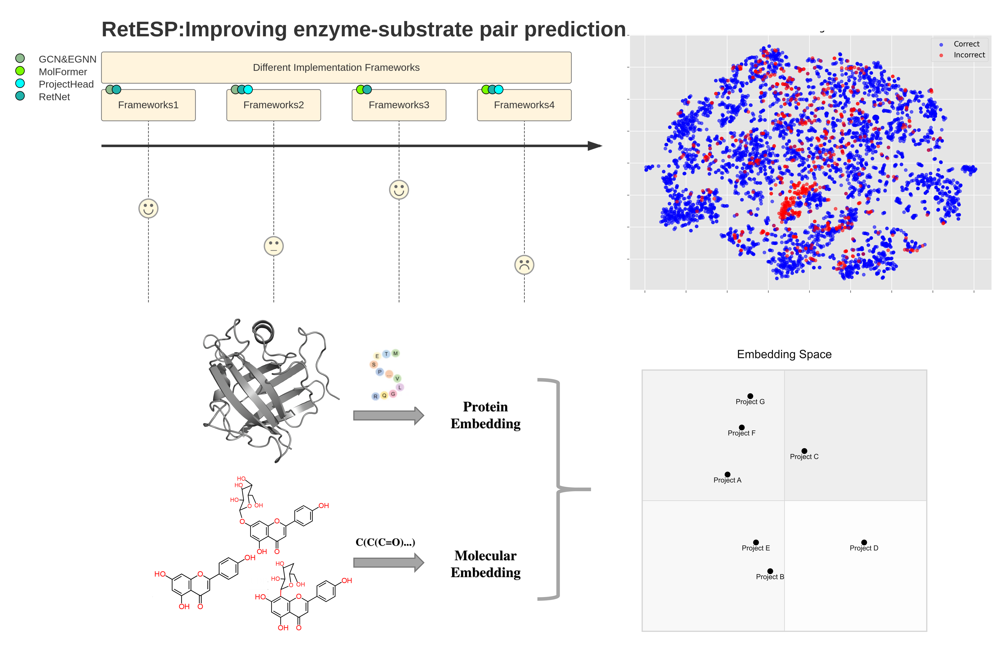
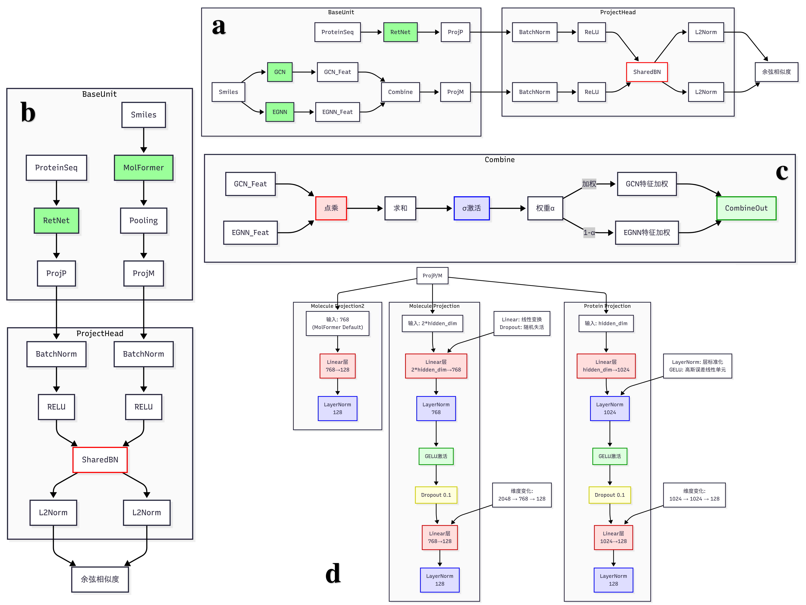

# 基于RetESP的酶-底物对预测情况

## 项目概述

**RetESP** 是一个基于深度学习的模型，旨在高效准确地预测酶与底物之间的配对关系。通过集成Retentive Network（RetNet）与MolFormer或图神经网络（GCN+EGNNC），RetESP结合了蛋白质序列处理和分子几何表示的优势，在降低计算成本的同时，实现了优异的预测性能。RetESP在多个数据集上表现良好，有一定泛化能力。
> 更多介绍请见```report.pdf```

<p align = "center">  


</p >  

## 主要特性

- **高效性**：RetNet的低计算复杂度使其适用于长序列处理。
- **多模态融合**：将蛋白质序列与分子的几何或预训练表示相结合。
- **灵活性**：提供两种架构变体以适应不同场景。
- **用户友好**：可自定义程度高
## 安装

### 环境要求

- Python 
- PyTorch 
- Transformers 
- RDKit（可选，取决于所选架构）
- fair-esm（可选，取决于所选架构）
- and so on.

### 安装步骤

1. 克隆仓库：
   ```bash
   git clone https://github.com/Amiharuka/RetESP.git
   cd RetESP
   ```
2. 安装依赖

3. （可选）对于RetNet+MolFormer架构，下载预训练的MolFormer模型，并适当修改```RetESP.py```：
   ```bash
   huggingface-cli download ibm/MoLFormer-XL-both-10pct --local-dir molformer_checkpoint
   ```

## 快速开始

- 训练
```python
python 05_datasetSplit.py -i 输入.csv
python preprocess.py --input 输入train.csv --output 输出train.pkl
python preprocess.py --input 输入valid.csv --output 输出valid.pkl
python train.py --train_data 输出train.pkl --test_data 输出valid.pkl
 (-h 供您查阅更多自定义参数)
```
- 预测（尚未开放）

## 训练数据准备

RetESP需要蛋白质序列和小分子的SMILES表示。数据应以CSV或JSON格式组织，按照顺序包含以下字段：

- `label`：配对标签（0或1）
- `sequence`：蛋白质氨基酸序列
- `smiles`：小分子的SMILES字符串

### 数据预处理

使用`preprocess.py`脚本对原始数据进行预处理，生成模型可直接使用的特征。脚本将对序列和分子进行清洗、编码和图结构构建。

```bash
python preprocess.py --input raw_data.csv --output processed_data.pkl
```

预处理步骤：
- **序列处理**：将氨基酸序列映射为整数编码，过滤掉无效字符（X、B、U、O）或长度不在5-2000之间的序列。
- **分子处理**：使用RDKit解析SMILES，生成原子ID、邻接矩阵和边特征（键类型）。（选用MolFormer架构则略去该步骤）

## 模型架构

RetESP提供两种主要架构：

1. **RetNet + GCN & EGNNC**
   - 使用RetNet处理蛋白质序列。
   - 利用GCN和EGNNC提取小分子的图特征。
   - 通过不同的投影头将蛋白质和分子嵌入映射到共享空间。（可选）
   - 基于几何表示，适用于需要显式建模分子拓扑的场景。

2. **RetNet + MolFormer**
   - 使用RetNet编码蛋白质序列。
   - 采用MolFormer生成小分子的预训练表示。
   - 通过不同的投影头优化嵌入。（可选）
   - 适用于利用大规模预训练模型以提高计算效率的场景。

### 投影头选择

- **Null**：不对嵌入进行整流
- **ProjectHead**：使用耦合投影头进行嵌入单层整流(推荐)
- **FusionProjectHead**：使用非耦合投影头进行嵌入单层整流
- **FusionProjectHead2**：使用非耦合投影头进行嵌入双层整流

## 训练模型

使用`train.py`脚本进行模型训练。脚本支持训练、测试和训练+测试模式，并允许从检查点恢复训练。（测试模式尚未开放）

### 示例代码

```python
from RetESP import RetESP
from train import train_epoch, run_validation
import torch

# 选择架构：'retnet_gcn' 或 'retnet_molformer'
config = {
    'gcn_layer': 2,
    'egnn_layer': 2,
    'ret_layer': 2,
    'heads': 4,
    'lr': 1e-3,
    'WD': 0.0005,
    'hidden_dim': 512,
    'ffn_size': 512,
    'projection_dim': 128
}
model = RetESP(config)

# 加载数据
train_loader = load_datasets(args, 'train')
val_loader = load_datasets(args, 'test')

# 训练模型
optimizer = torch.optim.AdamW(model.parameters(), lr=config['lr'], weight_decay=config['WD'])
loss_fn = torch.nn.MSELoss()
device = torch.device('cuda' if torch.cuda.is_available() else 'cpu')
model.to(device)

for epoch in range(1, 61):
    train_metrics = train_epoch(model, optimizer, train_loader, device, loss_fn)
    val_metrics = run_validation(model, val_loader, loss_fn, device)
    # 保存最佳模型等
```

### 训练参数

- `--mode`：运行模式（train/test/both）
- `--batch_size`：批次大小，默认128
- `--epochs`：训练轮数，默认60
- `--lr`：学习率，默认1e-3
- `--WD`：权重衰减，默认0.0005
- `--resume`：是否从检查点恢复训练
- and so on.

## 预测

加载训练好的模型并对新数据进行预测。

```python
# 加载训练好的模型
model.load_state_dict(torch.load('modelstate/best_model.pth'))

# 对新数据进行预测
new_data_loader = load_datasets(args, 'test')  # 替换为新数据
model.eval()
with torch.no_grad():
    for labels, seq, smiles in new_data_loader:
        inputs = (seq, smiles)
        protein_embed, mol_embed = model(inputs)
        cos_sim = torch.nn.functional.cosine_similarity(protein_embed, mol_embed)
        predictions = (cos_sim > 0.5).float()
```

## 贡献

我们欢迎对RetESP项目的贡献！请遵循以下步骤：

1. Fork仓库。
2. 创建新分支（`git checkout -b feature/your-feature`）。
3. 提交更改（`git commit -am 'Add your feature'`）。
4. 推送到分支（`git push origin feature/your-feature`）。
5. 提交Pull Request。


## 许可证

本项目采用GPL-3.0 license许可证。详情请参阅[LICENSE](LICENSE)文件。